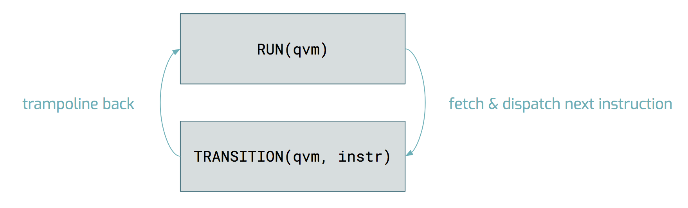
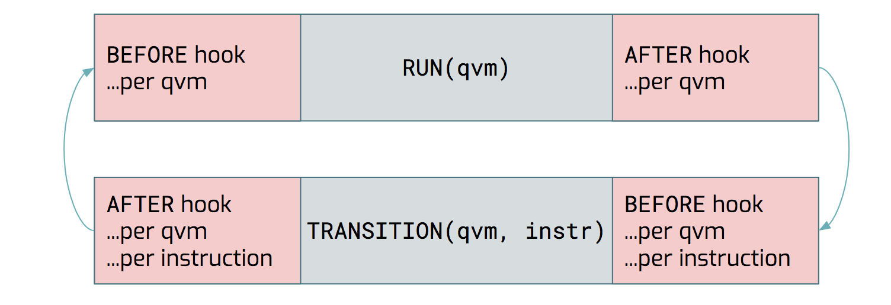

The Mathematical Model
======================

The QAM and the QVM
-------------------

This repository contains the python implementation of the mathematical object known as a quantum-abstract-machine (QAM).
The QAM is a model of hybrid classical/quantum computation that executes the instruction language called Quil.  A
specification of a QAM involves

* Some number of qubits and their labels
* Some amount of classical memory with the addresses
* A fixed gate set
* Quil instructions
* A program counter

With this minimal description a full simulation of the quantum abstract machine can be implemented on a classical
computer.  The resulting program is known as the quantum-virtual-machine (QVM).  In this case the QVM is implemented in
python with a subset of all commands specified in the original Quil paper.

The QVM is a state-machine with matrix-vector multiplication as a transition.  The state of the machine is the quantum state, classical
memory, and a program counter.  By default the quantum state is initialized to the vector corresponding to the

.. math::
    \vert 000...00 \rangle

and classical memory is allocated to zeros

.. code-block:: python

    [0, 0, ..., 0]

The key operations of the state machine are to fetch an instruction, a transition of the machine, and trampoline back.
Fetching an instruction provides a quantum gate, classical instruction, or control flow statement corresponding to the
Quil instruction index by the program counter.  The following is a diagram of the QVM state machine:

A wavefunction would include either the application of a gate or a
measurement of the state.  The following section provides a description of the code that applies arbitrary k-qubit gates
and measurement on a single qubit.

Because of the modularity of the QVM state machine we can add hooks that effect the behavior at any point in the state
machine cycle.  These effects can be a noise model, debugging statistics, or other state transformations.

A custom hook can be added by appending it to the set of functions to occur before the trampoline back.  This makes
development on the qvm extremely simple and transferable to different models or QVMs.

Wavefunction-, Unitary-, Rho-transition types
---------------------------------------------

When specifying the qvm object the user has the option to select which type of qvm transition will be used.  By default
the wavefunction transition is selected.  This means that updates to the quantum state follow the circuit model where
gates are elements of :math:`U(2^{n})` that operate on the wavefunction.  The unitary transition model aggregates
the unitary representing the gates by left matrix-multiplying each element of :math:`U(2^{n})` that is provided
by the `next_instruction` function of the state machine. Having access to the unitary that corresponds to a circuit
is very useful for debugging gates, debug programs by comparing the output against exponentiating an operator,
or for density matrix evolution.

The :math:`\rho` transition is the density matrix simulator that where the transition evolves the density matrix forward
according to the matrix :math:`U(2^{n})`.

.. math::

    \rho_{t + 1} = U \rho_{t} U^{\dagger}

